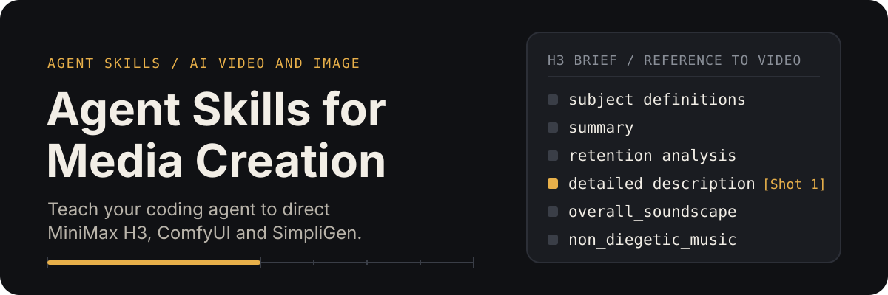
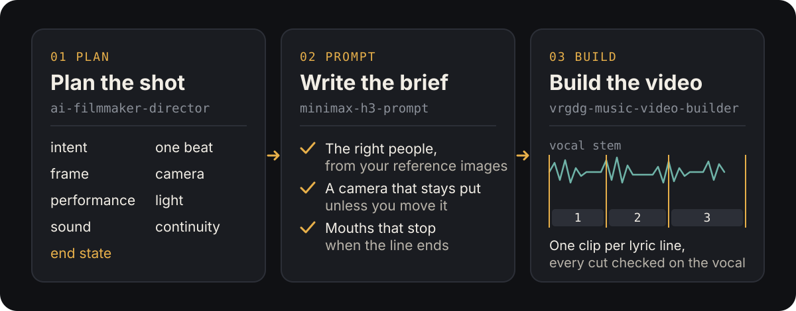

# Agent Skills for Media Creation

<p align="center">
  
</p>

Skills that teach a coding agent (Claude Code, Codex, Gemini CLI and others) how to direct AI video and image models.
They come out of day-to-day work with SimpliGen and ComfyUI, mostly on MiniMax H3, and are
written up from what actually worked on real renders.

## The skills

<p align="center">
  
</p>

| Skill | What it does |
|---|---|
| [`minimax-h3-prompt`](skills/minimax-h3-prompt/) | Writes MiniMax H3 video prompts as structured briefs instead of prose: SimpliGen H3 presets, ComfyUI H3 nodes or the API. Covers dialogue and singing shots, keeping a character's or product's look from reference images, multi-character wide shots, and the usual failures (wrong people, drifting camera, mouths that keep moving after the line ends). Includes a design-sheet and "character PV" recipe. |
| [`vrgdg-music-video-builder`](skills/vrgdg-music-video-builder/) | Makes or fixes a lip-synced music video with the VRGDG Music Video Builder (comfyui-vrgamedevgirl) on ComfyUI with MiniMax H3: scene prompts, performer rotation, checking every cut against the vocal stem, splitting scenes, and verifying the final stitch. Ships three helper scripts. |
| [`ai-filmmaker-director`](skills/ai-filmmaker-director/) | A model-agnostic shot-planning layer: intent, one beat per shot, framing, camera, performance, light, sound, continuity and end state. Plans the shot, then hands off to a model-specific skill when one is installed. |

## Install

With the [skills CLI](https://github.com/vercel-labs/skills):

```bash
npx skills add michaeldune/agent-skills-for-media-creation
```

To install one skill only:

```bash
npx skills add michaeldune/agent-skills-for-media-creation --skill minimax-h3-prompt
```

Or copy a folder from `skills/` into your agent's skills directory (for Claude Code, `~/.claude/skills/`).

## What you need

- `minimax-h3-prompt` and `ai-filmmaker-director` are instructions only. They need a way to run the model: SimpliGen,
  ComfyUI with the MiniMax H3 nodes, or the MiniMax API.
- `vrgdg-music-video-builder` needs a plain ComfyUI install with the comfyui-vrgamedevgirl and ComfyUI-KJNodes packs and
  the MiniMax H3 reference-to-video model. Its scripts need Python with `av` (PyAV), `numpy` and `opencv-python`.
  Timings in the skill are from an RTX 4070 Ti 12 GB with 32 GB of RAM.

## Related skills that are not in this repository

- **[`h3-prompt-writing`](https://github.com/MiniMax-AI/MiniMax-H3/tree/main/skills/h3-prompt-writing)** is MiniMax's own
  skill for the H3 prompt format, in the [MiniMax-AI/MiniMax-H3](https://github.com/MiniMax-AI/MiniMax-H3) repository.
  `minimax-h3-prompt` builds on the same format.
- **[`yue2-music`](https://github.com/multimodal-art-projection/YuE/tree/main/skills/yue2-music)** is the YuE2 authors'
  skill for song generation, in the [multimodal-art-projection/YuE](https://github.com/multimodal-art-projection/YuE)
  repository (Apache-2.0).

## Credits

- `minimax-h3-prompt`: the design-sheet and character PV references rebuild the
  ["MiniMax H3 Epic Character PV"](https://www.runninghub.ai/post/2095032985100173313) method shown by
  [Smart Bobo](https://www.youtube.com/@Smart-Bobo-AI) (机智波玩ai).
- `ai-filmmaker-director`: adapted from the "AI Filmmaker Director" skill document shared by Magnavex on the SimpliGen
  Discord, which was built from the infographic "How to Prompt Like an AI Filmmaker" by Shailesh (@BEGINNERSBLOG).
- `vrgdg-music-video-builder`: written for the Music Video Builder in
  [comfyui-vrgamedevgirl](https://github.com/vrgamegirl19/comfyui-vrgamedevgirl) by VRGameDevGirl.

## License

MIT. See [LICENSE](LICENSE).

## A note on results

These are working notes turned into instructions, not guarantees. Video models re-roll: the same prompt and seed can
give a different clip, so where a skill says something "worked", it says how many takes that was.
